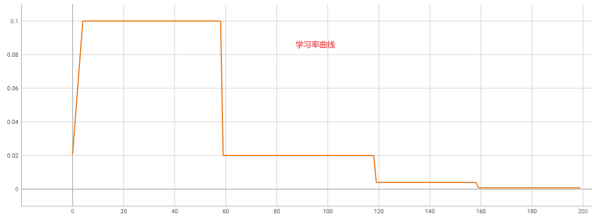
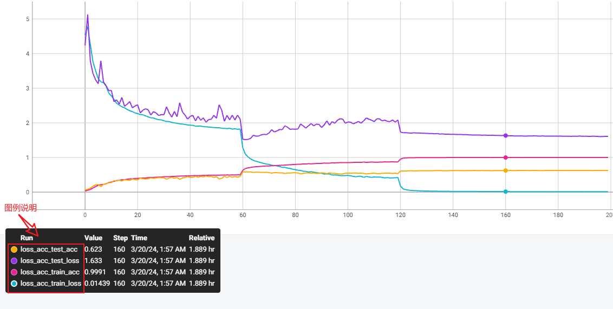
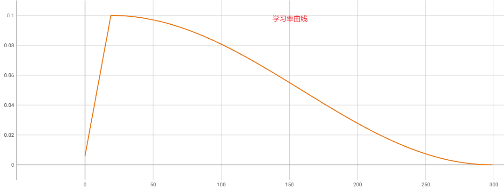
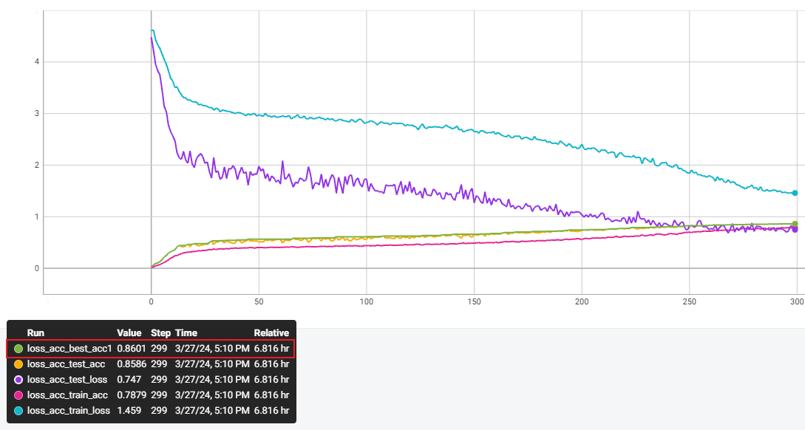

# Strong Baselines for CIFAR100

本人目前使用ResNet50在CIFAR100数据集上的最好结果为**86.01%**，在不使用额外数据的情况下已经达到了papers with code排行榜中纯CNN架构的SOTA

> My current best result using ResNet50 on the CIFAR100 dataset is **86.01%**, which has achieved the state-of-the-art (SOTA) among pure CNN architectures on the Papers with Code leaderboard without using additional data.

|               模型名                |  acc (%)  | 训练时间 |                    权重及训练日志下载地址                    |    备注     |
| :---------------------------------: | :-------: | :------: | :----------------------------------------------------------: | :---------: |
|             ResNet50-E5             |   86.01   | 6:50:28  | [百度网盘](https://pan.baidu.com/s/1qwW-jEnL5SnKull2Pl35Zw?pwd=l2ok)，[谷歌网盘](https://drive.google.com/file/d/1DdFcILRpM9jJR7a584_MYsUtF-DfH8QQ/view?usp=drive_link) |             |
|             WRN-50-2-E5             |   85.74   | 12:35:44 |                                                              |             |
|            ResNet-101-E5            |   85.50   | 10:02:03 |                                                              |             |
|            ResNet-152-E5            |   86.38   | 14:57:37 |                                                              |             |
|               E6-tiny               |   85.49   | 10:16:27 |                                                              |             |
|              E6-small               |   86.32   | 19:47:55 |                                                              |             |
|    WRN-18-10-E6 (resnet18_10_E6)    |   85.03   | 10:45:00 |                                                              |             |
| WRN-18-10-E6-v2 (resnet18_10_E6_v2) |   85.22   | 7:48:08  |                                                              |             |
| WRN-26-10-E6-v2 (resnet26_10_E6_v2) |   85.00   | 16:04:39 |                                                              |             |
| WRN-34-10-E6-v2 (resnet34_10_E6_v2) |   85.55   | 19:06:49 |                                                              |             |
|  ResNet272-E6-v2 (resnet272_E6_v2)  | **86.39** | 18:14:55 |                                                              | 双卡RTX3090 |

## 前言

本仓库聚焦于图像分类任务，使用了模型结构设计、数据增强、训练的tricks等方法，为CIFAR100数据集提供一个较强的基线结果。

- 数据集下载地址：https://www.cs.toronto.edu/~kriz/cifar.html
- papers with code排行榜：https://paperswithcode.com/sota/image-classification-on-cifar-100
- 训练框架使用本人根据Pytorch官方修改而来的图像分类训练框架：https://github.com/tcmyxc/CV-Tutorial
- 硬件配置：单卡RTX3090（多卡训练的结果会单独标注）

## 基线

模型选择：ResNet模型系列，主要针对ResNet50模型进行结构上的修改

模型原始实现：[TorchVision](https://github.com/pytorch/vision/blob/main/torchvision/models/resnet.py)

基础训练配置：

| 配置项                       | 配置描述                                               | 参考文献                                     |
| :--------------------------- | :----------------------------------------------------- | :------------------------------------------- |
| lr                           | 0.1                                                    | [Cutout](https://arxiv.org/abs/1708.04552v2) |
| batch size                   | 128                                                    | [Cutout](https://arxiv.org/abs/1708.04552v2) |
| epochs                       | 200                                                    | [Cutout](https://arxiv.org/abs/1708.04552v2) |
| lr scheduler                 | multisteplr (divide by 5 at 60th, 120th, 160th epochs) | [Cutout](https://arxiv.org/abs/1708.04552v2) |
| optimizer                    | SGD                                                    | [Cutout](https://arxiv.org/abs/1708.04552v2) |
| momentum                     | 0.9                                                    | [Cutout](https://arxiv.org/abs/1708.04552v2) |
| weight decay                 | 5e-4                                                   | [Cutout](https://arxiv.org/abs/1708.04552v2) |
| lr warmup epochs（预热轮数） | 5                                                      |                                              |
| lr warmup method（预热方式） | linear                                                 |                                              |

数据增强：

```python
RandomCrop(size=(32, 32), padding=4)
RandomHorizontalFlip(p=0.5)
ToTensor()
Normalize(mean=(0.5071, 0.4866, 0.4409), std=(0.2673, 0.2564, 0.2762))
```

训练结果：

| 模型名称   | 实验结果 | 训练时间 | 备注            |
| ---------- | -------- | -------- | --------------- |
| ResNet50-T | 62.72    | 2:23:15  | TorchVision实现 |

训练脚本：

```bash
torchrun --nproc_per_node=1  --master_port="29169" classification/train.py \
    --model resnet50_T \
    --model_lib custom \
    --data_name cifar100 \
    --batch-size 128 \
    --lr 0.1 \
    --lr-scheduler multisteplr \
    --wd 5e-4 \
    --epochs 200 \
    --lr-warmup-epochs 5 \
    --loss_type ce \
    --print-freq 100 \
    --data-path /path/to/cifar100  # CIFAR100数据集路径
```

训练曲线：

（1）学习率曲线




（2）loss & acc 曲线



## 模型结构改进

| 基础架构 | 第一个7x7卷积变成3x3，同时stride变成1，pad变成1 | 去除第一个最大池化层 | 最后一个block的stride变为1 | 下采样块使用ResNet-D的方式 | 实验结果  | 模型后缀 |  时间   |
| :------: | :---------------------------------------------: | :------------------: | :------------------------: | :------------------------: | :-------: | :------: | :-----: |
|    √     |                                                 |                      |                            |                            |   62.72   |    T     | 2:23:15 |
|          |                        √                        |                      |                            |                            |   73.72   |    E1    | 2:35:00 |
|          |                        √                        |          √           |                            |                            |   80.39   |    E2    | 3:27:15 |
|          |                        √                        |          √           |             √              |                            | **80.53** |    E3    | 4:15:35 |
|          |                        √                        |          √           |             √              |             √              | **80.91** |    E5    | 4:34:45 |

## 训练tricks

TODO list：

- [x] 权重初始化方式
- [x] 学习率调度器
- [x] 余弦调度器的min lr
- [x] weight dacay参数
- [x] SGD优化器中的nesterov参数
- [x] 混合精度训练

### 权重初始化方式

| 初始化方式 | 实验结果  | 模型后缀 |  时间   |
| :--------: | :-------: | :------: | :-----: |
|  kaiming   |   80.39   |    E2    | 3:27:15 |
|    随机    |   80.44   |    E2    | 3:32:11 |
|  kaiming   | **80.53** |    E3    | 4:15:35 |
|    随机    |   80.18   |    E3    | 3:39:21 |
|  kaiming   | **80.91** |    E5    | 4:34:45 |
|    随机    |     -     |    E5    |    -    |

### 学习率调度器

| 学习率 | epoch |                   学习率调度器                    | 预热轮数 |    E3     |         |    E5     |         |
| :----: | :---: | :-----------------------------------------------: | :------: | :-------: | :-----: | :-------: | :-----: |
|        |       |                                                   |          | 实验结果  |  时间   | 实验结果  |  时间   |
|  0.1   |  200  | MultiStepLR，milestones=[60, 120, 160]，gamma=0.2 |    5     |   80.53   | 4:15:35 |   80.91   | 4:34:45 |
|  0.01  |  200  |                       余弦                        |    5     |   76.01   | 4:11:33 |   76.52   | 4:04:48 |
|  0.1   |  200  |                       余弦                        |    5     |   81.12   | 4:21:07 | **81.91** | 4:29:49 |
|  0.1   |  300  |                       余弦                        |    20    | **82.09** | 6:17:18 |   81.88   | 7:02:52 |
|  0.1   |  300  |   MultiStepLR，milestones=[150, 225]，gamma=0.1   |    5     |   81.55   | 6:15:47 |   81.65   | 6:03:52 |

最优结果的脚本：

```bash
torchrun --nproc_per_node=1  --master_port="29169" classification/train.py \
    --model resnet50_E3 \
    --model_lib custom \
    --data_name cifar100 \
    --batch-size 128 \
    --lr 0.1 \
    --lr-scheduler cosineannealinglr \
    --epochs 300 \
    --lr-warmup-epochs 20 \
    --wd 5e-4 \
    --loss_type ce \
    --print-freq 100 \
    --data-path /path/to/cifar100
```

**后续实验会使用数据增强，选择300轮、余弦、预热20轮的训练策略**

### 余弦调度器的min lr

| min lr |      E3      |         |      E5      |         |
| :----: | :----------: | :-----: | :----------: | :-----: |
|        | accuracy (%) |  时间   | accuracy (%) |  时间   |
| 不设置 |    82.09     | 6:17:18 |    81.88     | 7:02:52 |
|  1e-4  |    81.79     | 6:24:11 |    82.04     | 7:19:53 |
|  5e-5  |    81.72     | 6:40:56 |      -       |    -    |
|  1e-5  |    81.97     | 6:03:51 |    81.83     | 6:41:01 |
|  5e-6  |    81.47     | 6:03:59 |      -       |    -    |
|  1e-6  |  **82.23**   | 7:32:35 |    82.19     | 6:39:44 |
|  1e-7  |    81.43     | 7:00:48 |      -       |    -    |

结论：**min lr 可以选择 1e-6**

最优结果脚本：

```bash
torchrun --nproc_per_node=1  --master_port="29169" classification/train.py \
    --model resnet50_E3 \
    --model_lib custom \
    --data_name cifar100 \
    --batch-size 128 \
    --lr 0.1 \
    --lr-scheduler cosineannealinglr \
    --epochs 300 \
    --lr-warmup-epochs 20 \
    --lr-min 1e-6 \
    --wd 5e-4 \
    --loss_type ce \
    --print-freq 100 \
    --data-path /path/to/cifar100
```

### weight dacay参数

| weight decay | E3           |         | E5           |         |
| ------------ | ------------ | ------- | ------------ | ------- |
|              | accuracy (%) | 时间    | accuracy (%) | 时间    |
| 5e-4         | **82.23**    | 7:32:35 | **82.19**    | 6:39:44 |
| 1e-4         | 80.19        | 6:49:08 | 80.79        | 6:41:11 |

结论：**wd选择5e-4即可**

### SGD优化器中的nesterov参数

| nesterov | E3           |         | E5           |         |
| -------- | ------------ | ------- | ------------ | ------- |
|          | accuracy (%) | 时间    | accuracy (%) | 时间    |
| false    | **82.23**    | 7:32:35 | **82.19**    | 6:39:44 |
| true     | 81.80        | 7:08:40 | 82.18        | 6:56:26 |

结论：CIFAR-100**没必要**使用这个参数

### 混合精度训练

| amp   | E3           |         | E5           |         |
| ----- | ------------ | ------- | ------------ | ------- |
|       | accuracy (%) | 时间    | accuracy (%) | 时间    |
| false | **82.23**    | 7:32:35 | **82.19**    | 6:39:44 |
| true  | 81.86        | 5:10:42 | 82.15        | 5:14:29 |

结论：显存够的情况下**可以不用**

## 数据增强

- [x] AA
- [x] Cutout
- [x] mixup
- [x] cutmix
- [x] 随机擦除

|  AA  | Cutout或者随机擦除 | mixup | cutmix |   E3    |         |    E5     |         |
| :--: | :----------------: | :---: | :----: | :-----: | :-----: | :-------: | :-----: |
|      |                    |       |        | acc (%) |  时间   |  acc (%)  |  时间   |
|  -   |         -          |   -   |   -    |  82.23  | 7:32:35 |   82.19   | 6:39:44 |
|  √   |         -          |   -   |   -    |  82.53  | 7:03:52 |   83.14   | 6:44:57 |
|  √   |       Cutout       |   -   |   -    |  83.28  | 6:59:20 |   83.89   | 6:52:00 |
|  √   |       Cutout       |   √   |   -    |  84.55  | 7:25:32 |   84.95   | 7:20:48 |
|  √   |       Cutout       |   √   |   √    |  85.26  | 7:00:02 |   85.61   | 6:32:51 |
|  √   |  随机擦除，p=0.25  |   -   |   -    |  83.53  | 7:13:41 |   83.48   | 7:02:13 |
|  √   |  随机擦除，p=0.5   |   -   |   -    |  83.22  | 7:23:03 |   83.58   | 7:17:09 |
|  √   |  随机擦除，p=0.25  |   √   |   -    |  84.20  | 7:12:36 |   84.67   | 6:41:36 |
|  √   |  随机擦除，p=0.5   |   √   |   -    |    -    |    -    |   84.60   | 7:10:00 |
|  √   |  随机擦除，p=0.25  |   √   |   √    |  85.50  | 6:54:06 | **86.01** | 6:50:28 |
|  √   |  随机擦除，p=0.5   |   √   |   √    |    -    |    -    |   85.81   | 7:06:10 |

 最优结果脚本：

```bash
# 86.01
torchrun --nproc_per_node=1  --master_port="29429" classification/train.py \
    --model resnet50_E5 \
    --model_lib custom \
    --data_name cifar100 \
    --batch-size 128 \
    --lr 0.1 \
    --lr-scheduler cosineannealinglr \
    --epochs 300 \
    --lr-warmup-epochs 20 \
    --lr-min 1e-6 \
    --wd 5e-4 \
    --auto_augment \
    --random_erase 0.25 \
    --mixup-alpha 1 \
    --cutmix-alpha 1 \
    --loss_type ce \
    --print-freq 100 \
    --output-dir ./work_dir/aa-re_0.25-mixup-cutmix \
    --data-path /path/to/cifar100
```

最优结果训练曲线：

（1）学习率曲线



（2）loss & acc 曲线



## Cite

If you find this repo useful in your research, please consider citing:

```bibtex
@software{xu2024strong,
    title        = {Strong Baselines for CIFAR100},
    author       = {Wenxiang Xu},
    year         = 2024,
    journal      = {GitHub repository},
    publisher    = {GitHub},
    howpublished = {\url{https://github.com/tcmyxc/Strong-Baselines-for-CIFAR100}}
}
```

